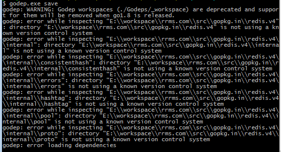

在使用godep过程中有时会遇到一些手动下载的第三方包，这时通过godep save管理第三方包时会出现找不到包版本的提示

在网上找了很久，终于找到解决方法。原文地址忘了，在此记录下作为备份

godep在生成Godeps文件夹时会读取包里的版本，既然这样就可以在手动下载的包里手动添加git init初始化git,然后git add . 和git commit -m "" 对包添加git管理，这时重新运行godep save命令就会在项目中生成Godeps包管理

附录godep安装

[godep下载地址](https://github.com/golang/tools) 是 golang.org/x/tools的一个镜像，代码是一样的，所以我是如下安装的。

go get github.com/golang/tools

在GOPATH\src\github.com目录下就有tools文件夹。

在src下和github.com平级新建golang.org文件下，在此文件夹下建x文件夹，然后将tools都复制进去。

然后再执行go get github.com/tools/godep。

此时godep安装在你的GOPATH\bin目录下。
